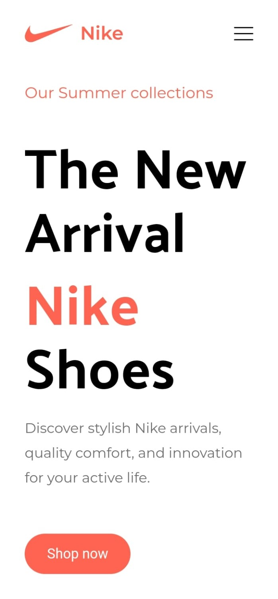
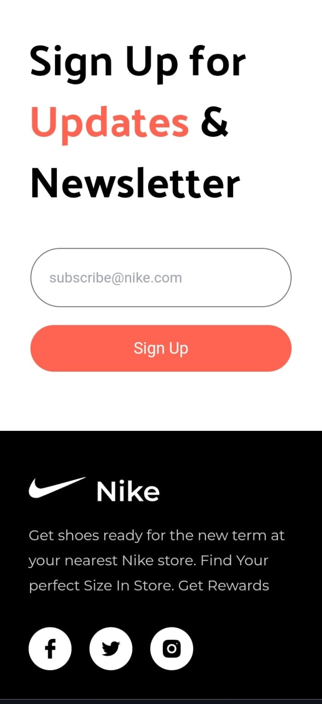
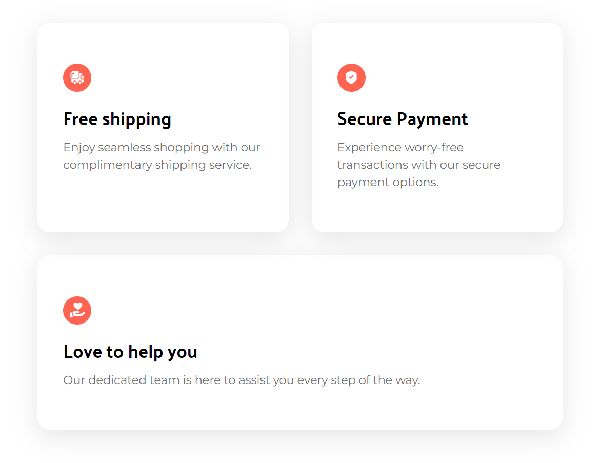

<h1>Nike Clone</h1>

This is a **Nike Clone** web application built using **Vite** and **React**. The project is styled with **Tailwind CSS** for a responsive and modern user interface.

Features
--------

*   **Home Page**: Display of Nike products with modern, clean design.
*   **Responsive Design**: Fully responsive and optimized for mobile, tablet, and desktop views.
*   **Interactive Elements**: Smooth animations and hover effects for better user experience.

Future Updates
----------
- Migration to Next JS
- Full stack web app
- Database connectivity with MongoDB 

Tech Stack
----------

*   **React**: Component-based UI library for building interactive interfaces.
*   **Vite**: Fast development build tool for modern web projects.
*   **Tailwind CSS**: Utility-first CSS framework for rapid styling.

Screenshots
----------------------

----
|  |  |
|---------------------------------|---------------------------------|

Installation and Setup
----------------------

1.  **Clone the Repository**:
    
        git clone https://github.com/kavanbhavsar35/nike-clone.git
    
2.  **Navigate to the Project Directory**:
    
        cd nike-clone
    
3.  **Install Dependencies**:
    
        npm install
    
4.  **Start the Development Server**:
    
        npm run dev
    
5.  Open your browser and navigate to [http://localhost:5173](http://localhost:5173) to see the application in action.

Credits
-------

This project is inspired by and based on a tutorial by [JavaScript Mastery](https://www.youtube.com/@javascriptmastery). Make sure to check out their amazing content for more projects and coding tutorials!

License
-------

This project is for educational purposes only and is not affiliated with Nike, Inc.

* * *

**Happy Coding!** 🎉